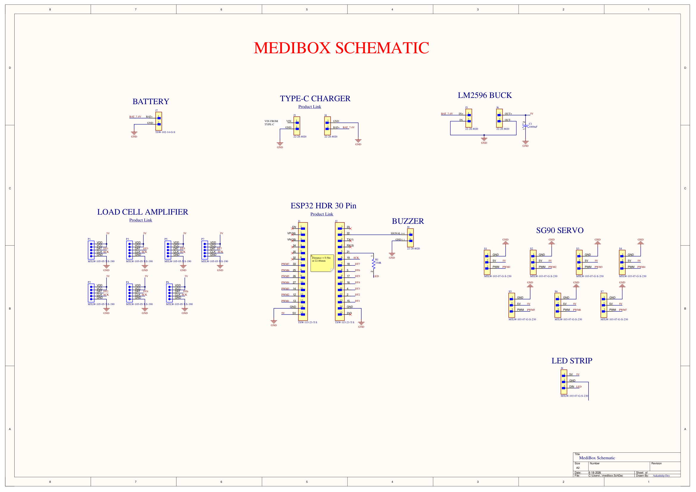

# Smart Medication Dispensing & Biometric Telemetry System
### Integrated IoT Healthcare Ecosystem: MediBox Base-Station & Wearable Companion

[](https://www.altium.com/)
[](#system-architecture-overview)
[](#pcb-stackup--manufacturing-specifications)
[-success?style=for-the-badge)](#design-rule-check--manufacturing-status)
[](LICENSE)

An end-to-end smart healthcare hardware ecosystem engineered to tackle patient medication non-adherence and remote health monitoring. The system comprises two synchronized hardware platforms:

1. **MediBox Base-Station:** A high-current automated 7-compartment pill dispenser with precision weight sensing and mechanical dispensing.
2. **Wearable Companion:** An ultra-compact, low-power wrist-worn ESP32-S3 device providing patient haptic alerts, battery monitoring, and biometric sensor interfacing.

---

## System Architecture Overview

```
 ┌─────────────────────────────────────────────────────────────────────────────────┐
 │                               MEDIBOX BASE-STATION                              │
 │                                                                                 │
 │   ┌─────────────────┐       ┌────────────────────────┐      ┌───────────────┐   │
 │   │  7.4V Li-Po /   │  ───> │ LM2596 Buck Regulator  │ ───> │  5V Bus Rail  │   │
 │   │  USB-C Charger  │       │ (1000µF Bulk Filtering)│      │  (60mil Cu)   │   │
 │   └─────────────────┘       └────────────────────────┘      └───────┬───────┘   │
 │                                                                     │           │
 │       ┌─────────────────────────────────────────────────────────────┼───────┐   │
 │       │                                                             │       │   │
 │   ┌───▼────────────────┐   ┌───────────────────────────┐        ┌───▼───┐ ┌─▼─┐ │
 │   │ 7x SG90 Servos     │   │ ESP32 Core Controller     │        │WS2812B│ │BUZ│ │
 │   │ (PWM1 - PWM7)      │ <─┤ - Wi-Fi & BLE Gateway     │ ─────> │RGB LED│ │ZER│ │
 │   └────────────────────┘   │ - Shared SCK Bus (GPIO19) │        │Strip  │ │   │ │
 │   ┌────────────────────┐   │ - 7x Dedicated Data Lines │        └───────┘ └───┘ │
 │   │ 7x HX711 Load Cell │ ─>│   (DT1 - DT7)             │                        │
 │   │ Weight Amplifiers  │   └─────────────┬─────────────┘                        │
 │   └────────────────────┘                 │                                      │
 └──────────────────────────────────────────┼──────────────────────────────────────┘
                                            │ BLE 5.0 Wireless Telemetry
                                            ▼
 ┌─────────────────────────────────────────────────────────────────────────────────┐
 │                               WEARABLE COMPANION                                │
 │                                                                                 │
 │   ┌──────────────┐     ┌──────────────────────┐     ┌───────────────────────┐   │
 │   │ USB Type-C   │ ──> │ Microchip MCP73831   │ ──> │ 3.7V Li-Po Battery    │   │
 │   │ (5.1k CC)    │     │ Li-Ion Charger (SOT) │     │ (ADC State-of-Charge) │   │
 │   └──────┬───────┘     └──────────────────────┘     └───────────┬───────────┘   │
 │          │                                                      │               │
 │          └───────────┐                             ┌────────────┘               │
 │                      ▼                             ▼                            │
 │            ┌───────────────────────────────────────────────┐                    │
 │            │ Power Path Management (DMG2305 P-FET + Diode) │                    │
 │            └───────────────────────┬───────────────────────┘                    │
 │                                    ▼                                            │
 │                      ┌───────────────────────────┐                              │
 │                      │ AP2112K 3.3V 600mA LDO    │                              │
 │                      └─────────────┬─────────────┘                              │
 │                                    ▼                                            │
 │                      ┌───────────────────────────┐      ┌───────────────────┐   │
 │                      │ ESP32-S3-MINI-1-N8 SoC    │ ───> │ Haptic ERM Driver │   │
 │                      │ - 240MHz Xtensa Dual-Core │      │ (SI2302 + Flyback)│   │
 │                      │ - Built-in PCB Antenna    │      └───────────────────┘   │
 │                      │ - 4-Pin 0.5mm FPC Header  │ ───> Biometric / Display     │
 │                      └───────────────────────────┘                              │
 └─────────────────────────────────────────────────────────────────────────────────┘
```

---

## Subsystem 1: MediBox Base-Station

The **MediBox** serves as the central dispensing terminal, featuring 7 independently monitored medicine bays (one for each day of the week or multi-dose regimens).

### Hardware Design Highlights
* **Precision Pill Verification:** Each compartment integrates an **HX711 24-bit ADC / Load Cell Amplifier** module (`P1` - `P7`). 
  * Enables gravimetric sensing to verify that medication has physically dropped into the patient cup.
  * Employs a synchronized bus topology: all 7 load cells share a master clock (`SCK` on GPIO 19), with 7 discrete serial data return lines (`DT1` - `DT7` mapped to GPIOs 15, 2, 4, 16, 17, 5, 18).
* **Automated Dispensing Actuation:** Driven by 7 **SG90 micro servo motors** (`S1` - `S7`) controlled via dedicated hardware PWM outputs (`PWM1` - `PWM7` on GPIOs 13, 12, 14, 27, 26, 25, 33).
* **High-Current Power Distribution:** 
  * Accepts 7.4V 2S Li-Po battery or Type-C input.
  * Features an **LM2596 high-efficiency step-down switching regulator** capable of delivering up to 3A continuous at 5V.
  * Includes a **1000 µF low-ESR electrolytic capacitor (`C1`)** placed directly across the 5V power bus to suppress high-transient inrush currents when multiple servos actuate simultaneously.
  * Routed with **60 mil (1.52 mm) heavy-copper traces** to maintain tight voltage regulation and prevent MCU brownout.
* **Audio-Visual Patient Feedback:** 
  * Addressable WS2812B RGB LED strip header (`J8`) with a 330Ω inline series resistor (`R1`) for signal reflection damping.
  * Active buzzer connector (`J9`) driven by GPIO 22 for audible dose alarms.

### MediBox Schematic

*Figure 1: Complete MediBox schematic showing ESP32 pin breakout, HX711 cluster, servo bus, and LM2596 power stage.*

---

## Subsystem 2: Wearable Companion

The **Wearable Companion** is an ultra-compact, wrist-worn device designed to ensure patients never miss a medication window even when away from the base station.

### Hardware Design Highlights
* **Core Processing & RF:** **Espressif ESP32-S3-MINI-1-N8** with onboard PCB antenna, providing low-power BLE 5 advertising and mesh synchronization with the MediBox base station.
* **Intelligent Power Path Management:**
  * Uses a **Diodes Inc. DMG2305UX P-channel MOSFET** and an **onsemi MBR0520 Schottky barrier diode** to create an automatic ideal-diode power path switch.
  * Seamlessly powers the system from USB-C (5V) while simultaneously recharging the battery, without passing charging current through the cell.
* **Li-Ion Charge Management:**
  * **Microchip MCP73831T-2ACI/OT** standalone linear Li-Ion / Li-Polymer charger in SOT-23-5.
  * Pre-configured constant current / constant voltage charging algorithm with red LED charge status indicator (`D2`).
* **Ultra-Low Dropout Regulation:** **Diodes Inc. AP2112K-3.3TRG1** 600mA CMOS LDO delivering clean 3.3V with 250mV typical dropout voltage.
* **Haptic Vibration Actuation:**
  * Discrete driver circuit utilizing a **Vishay SI2302 N-channel MOSFET (`Q1`)** to drive an eccentric rotating mass (ERM) vibration motor (`M1`).
  * Clamped with a **Diodes Inc. B0540W Schottky freewheeling diode (`D1`)** to safely snub inductive flyback voltage spikes.
* **Peripheral FPC Expansion:** 
  * **Molex 503480-0440** 4-pin 0.5mm pitch right-angle FPC connector (`J1`) routing 3.3V, GND, and I2C/SPI lines for connecting an external PPG pulse oximeter sensor, IMU, or flexible OLED display.

---

## PCB Stackup & Manufacturing Specifications

### MediBox Base-Station PCB
* **Layer Count:** 2 Layers (Top Layer, Bottom Layer)
* **Trace Rules:** 8-10 mil signal traces; **60 mil heavy-current power traces** for 5V and 7.4V servo rails.
* **Thermal Relief:** 4-finger 10 mil conductor relief on ground polygons.
* **DRC Status:** **0 Violations**.

### Wearable Companion PCB
* **Layer Count:** 4 Layers (High-density compact stackup)
* **Trace Rules:** 7-10 mil signals; 25 mil preferred power traces (`VBUS_5V`, `3V3_RAIL`, `VBAT_RAW`, `SYS_VCC`).
* **Ground Distribution:** Solid continuous ground plane for RF antenna return and noise isolation.
* **DRC Status:** **0 Violations**.

---

## Bill of Materials (Key Components)

### MediBox Key Parts
| Designator | Component | Description | Function |
|:---|:---|:---|:---|
| **J1, J2** | Samtec TSW-115-23-T-S | 15-Pin Female Breakout Headers (2.54mm) | ESP32 Module Breakout Interface |
| **P1 - P7** | Samtec MTLW-105-05-T-S | 5-Pin Vertical Headers | 7x HX711 Load Cell Interface (VCC, DAT, CLK, GND) |
| **S1 - S7** | Samtec MTLW-103-07-G-S | 3-Pin Vertical Headers | 7x SG90 Micro Servo Connections (5V, GND, PWM) |
| **J5, J6** | Molex 22-28-8020 | 2-Pin Friction Lock Headers | LM2596 Buck Converter Input & Output |
| **C1** | 1000 µF / 16V | Electrolytic Radial Bulk Capacitor | High-inrush transient suppression for servos |
| **R1** | 330 Ω (0805) | Carbon Film Resistor | WS2812B Data line ringing dampener |
| **J8** | Samtec MTLW-103-07-G-S | 3-Pin Header | Addressable RGB LED Strip Interface |
| **J9** | Molex 22-28-8020 | 2-Pin Header | Active Piezo Buzzer Connection |

### Wearable Companion Key Parts
| Designator | Component | MPN | Package | Function |
|:---|:---|:---|:---|:---|
| **U1** | ESP32-S3 SoC Module | `ESP32-S3-MINI-1-N8` | SMD Module | Central processor, BLE 5 & Wi-Fi |
| **U2** | 600mA Low-Dropout LDO | `AP2112K-3.3TRG1` | SOT-25 | 3.3V System power regulation |
| **U3** | Li-Ion Charge Controller | `MCP73831T-2ACI/OT` | SOT-23-5 | 4.2V Single-cell Li-Po charger |
| **USB_J** | USB Type-C Receptacle | `217179-0001` | SMT Hybrid | 24-Pin USB-C port & charging input |
| **Q1** | N-Channel MOSFET 20V 2.8A | `SI2302CDS-T1-GE3` | SOT-23 | Haptic vibration motor driver |
| **Q2** | P-Channel MOSFET 20V 4.2A | `DMG2305UX-7` | SOT-23 | Automatic power-path switcher |
| **D1** | Schottky Barrier Diode 40V | `B0540W-7-F` | SOD-123 | Motor inductive flyback clamp |
| **D2** | Red SMD LED | 0603 Package | 0603 | Charging state indicator |
| **D3** | Schottky Barrier Diode 20V | `MBR0520LT1G` | SOD-123 | Power path ORing diode |
| **J1** | 4-Pin 0.5mm FPC Connector | `503480-0440` | SMT RA | Sensor / Display flex cable interface |
| **M1** | 2-Pin Solder Header | 2-Pin 2.54mm | Header | ERM coin vibration motor connection |
| **SW1, SW2** | SPST Tactile Switch | `PTS645SM43SMTR92LFS` | SMD Tact | Reset & Boot buttons |

---

## Repository Structure

```
├── MediBox-Base-Dispenser/
│   ├── Hardware/
│   │   ├── medibox.PrjPcb             # Altium project file
│   │   ├── medibox.SchDoc             # MediBox schematic
│   │   └── medibox.PcbDoc             # 2-layer high-current PCB layout
│   ├── Fabrication/
│   │   ├── medibox.GTL / .GBL         # Top & Bottom Copper Gerbers
│   │   ├── medibox.GTO / .GBO         # Silkscreen layers
│   │   ├── medibox.GTS / .GBS         # Soldermask layers
│   │   ├── medibox.TXT                # NC Drill data
│   │   └── Design_Rule_Check.drc      # DRC verification report (0 errors)
│   └── Documentation/
│       ├── medibox_schematic.pdf      # High-resolution vector schematic
│       └── medibox_schematic_preview.png
├── Wearable-Companion/
│   ├── Hardware/
│   │   ├── wearable.PrjPcb            # Altium project file
│   │   ├── wearable_sch.SchDoc        # Wearable schematic
│   │   ├── wearable2.PcbDoc           # 4-layer ultra-compact PCB layout
│   │   ├── wearable.SchLib            # Schematic component library
│   │   ├── wearable_pcb.PcbLib        # Footprint library
│   │   └── wearable.BomDoc            # Altium LiveBOM document
│   ├── Fabrication/
│   │   ├── wearable2.GTL / .GBL       # Top & Bottom Copper Gerbers
│   │   ├── wearable2.G1 / .GP1        # Internal Ground & Power planes
│   │   ├── wearable2.GTO / .GBO       # Silkscreen layers
│   │   ├── wearable2.GTS / .GBS       # Soldermask layers
│   │   ├── wearable2-RoundHoles.TXT   # NC Drill coordinates
│   │   └── Design_Rule_Check.drc      # DRC verification report (0 errors)
│   └── Documentation/
│       └── Wearable_Bill_of_Materials.pdf # Detailed component procurement BOM
├── Images/
│   └── medibox_schematic.png          # High-resolution schematic preview
└── README.md
```

---

## Author & Contact

**Aakashdip Dey**  
*Hardware & Embedded Electronics Engineer*  
* Vellore, India  
* GitHub: [@AakashdipDey](https://github.com/AakashdipDey)
